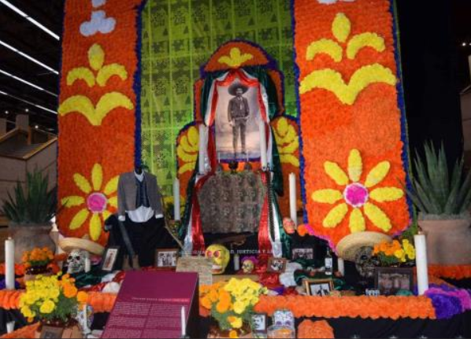
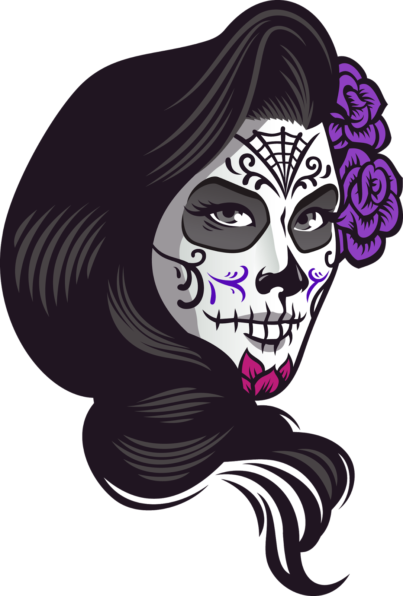

# Chatrina Bot - Proyecto Innovaccion Virutal
### Más alla del dia de los muertos

El proyecto de Catrina Bot se ideó para ser un sitio web en cual se pueda formentar la cultura de la fiesta del dia de los muerto, y servir como herramienta para personas locales y extranjeros

## Las Tecnologías implementadas son los siguientes:

* `Cognitive Services`
* `QnA Maker` 
* `WordPress` 
* `Web App Bot`  

Como equipo nos comprometimos a desarrollar una solución basada en tecnologías de Microsoft relacionadas con modelos de IA.

Nuestro Modelo esta implementado en un sitio web `Wordpress` el cual tiene una recoleccion de información de altares del dia de los muertos de tomando como referencia datos del Centro Cultural de Tijuana (CECUT).

El sitio web esta equipado con un con un Chatbot creado con `Web App Bot` que se ha entrenado con anterioridad usando `QnA Maker` como base de conocimiento para el Bot.

## Proyección a Futuro y Escalabilidad

A futuro se planea implementar una aplicacion web en la cual pueda implementarse el `Chatbot` y la IA para clasificacion de imagenes.

Tambien se planea expandirse a más Estados de México tomando como referencia información que se encuentre en los Centros Culturales de los Estados y cuidades de México, para que sirva como referencia a turistas que buscan conocer más la Cultura Mexicana

Referencias: `http://cecutmx.blogspot.com/2017/10/la-ofrenda-monumental-del-dia-de.html?q=Janitzio`

### Integrantes 
* Alvaro Gabriel Gonzales Martinez - viajero33138@innovaccion.mx
* Maria Fernanda Zamora - viajero34032@innovaccion.mx
* J Jesus Bernal Bernal Alcala -viajero34968@innovaccion.mx
* Luis Enrique Muñoz Martel - viajero06878@innovaccion.mx
